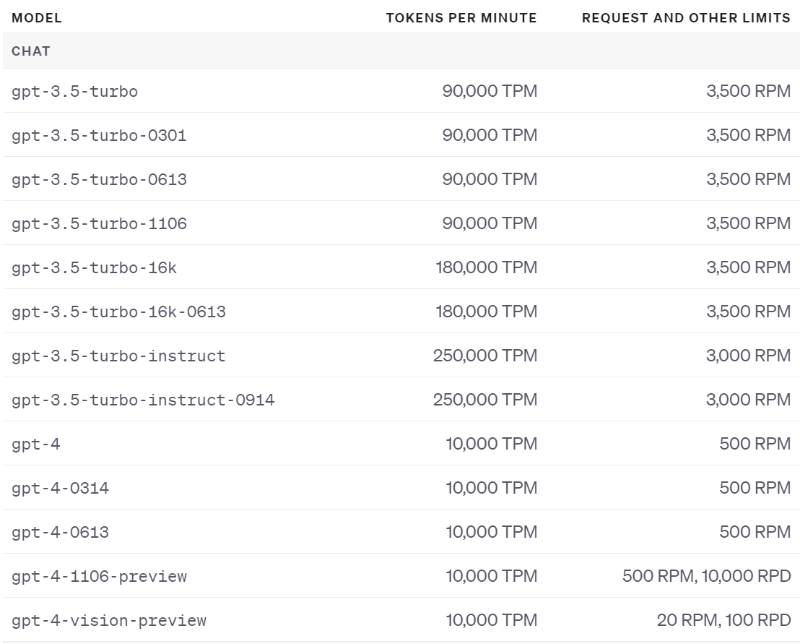

# chipgptv
benchmark on chipgptv


## chipgptv protocol 

Instruction: You are now acting as a professional verilog programmer. You will receive two kinds of input. One is the image input, which is used to describe the connectivity among modules or the state diagram of control module. The other is the text input, which is used to describe the behavior of each module, and the function of the design. You should output the verilog code of the design.


Prompt:

- Describe the function of the design.
- Describe what submodules the design contains.
- Describe the functionality of each submodule in the design.
- Give the module and submodule port list.


### Model Utilization

This mathematical model can be used to validate the integrity of a design's image representation and to facilitate the automatic generation of Verilog code by ensuring that all necessary connections and components are properly defined and interconnected.

## GPT Usage


**Alert** 

1. OpenAI take cost for each generated token, please use the api key carefully.
2. Please do not share the key publicly.
3. You need to connect the vpn to use the api.

**API Limitation**



**Example**

```
from openai import OpenAI

client = OpenAI(api_key=<API_KEY>)

response = client.chat.completions.create(
    model="gpt-4-vision-preview",
    messages=[
        {
            "role": "user",
            "content": [
                {"type": "text", "text": "Implement a module of an 8 bit adder using verilog in gate level. The datapath is shown in the picture."},
                {
                    "type": "image_url",
                    "image_url": <IMAGE_URL>,
                },
            ],
        }
    ],
    max_tokens=3000,
)

print(response.choices[0])
```

## Drawback

1. When the input image contains gate level circuit, the generated code is mostly not correct.
2. When the port name in the image does not map to the port name in the text, it would generate the wrong code. 
3. When llm meet some unfamiliar design, it would prefer to generate the code of the design which it is familiar with, but not align with the input image.

## Advantage

1. The gptv can deal with the inter connection between submodules
2. The gptv can have a good understanding about fsm
